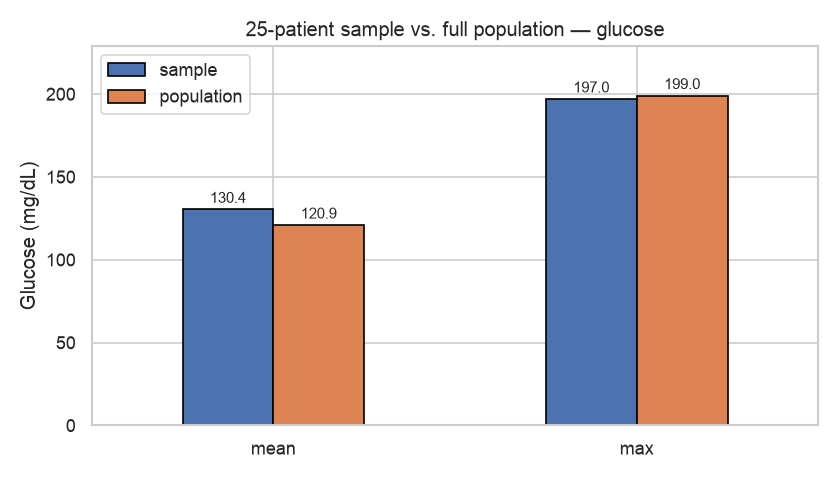

# How Well Does a Small Sample Represent Its Population?

Sampling is only useful if the sample resembles the population it came from. This project
treats the 768-patient Pima Indians Diabetes dataset as a *known* population, draws samples
from it, and measures exactly how far the sample statistics drift from the truth.

**[→ Read the notebook](notebooks/sampling_and_bootstrap.ipynb)**

## Data

`data/diabetes.csv` — 768 patients, 9 columns (glucose, blood pressure, BMI, insulin,
age, and a diabetes outcome flag).

## Method

**Part 1 — a single small sample.** Draw 25 patients and compare mean/max glucose and the
98th percentile of BMI against the full population.

**Part 2 — bootstrap.** Draw 500 samples of 150 patients each *with replacement* from the
blood pressure column, computing the mean, standard deviation, and 90th percentile of
every resample. This produces a *distribution* of estimates rather than a single number,
which shows both how accurate the estimator is and how much it varies.

Seeded with `random_state=123` throughout, so every figure reproduces exactly.

## Findings

### A single 25-patient sample is unreliable on means

| Statistic | Sample (n=25) | Population (n=768) | Error |
|---|---|---|---|
| Mean glucose | 130.36 | 120.89 | **+7.8%** |
| Max glucose | 197 | 199 | −1.0% |
| 98th pct BMI | 45.26 | 47.53 | −4.8% |

The **max** transfers almost perfectly (197 vs 199) — extremes are shared between a sample
and its population. The **mean** is off by nearly 8%, which in a clinical context is enough
to change how the data reads.

### Bootstrapping recovers the truth to under 1%

| Statistic | Bootstrap (500×150) | Population | Error |
|---|---|---|---|
| Mean | 69.05 | 69.11 | **0.08%** |
| Std deviation | 19.33 | 19.36 | **0.15%** |
| 90th percentile | 87.29 | 88.00 | **0.81%** |

Each histogram is 500 estimates; the red line is the population value being recovered.
All three distributions centre on their target — the estimators are unbiased — and the
spread shows how much any *single* sample of that size could plausibly be off by.

## Takeaways

1. A single small sample can miss a simple mean by 8%.
2. Averaging over many resamples cut that to under 1% on every statistic tested.
3. **Which statistic you're estimating matters as much as sample size.** Extremes survive
   small samples; central tendency does not.

## Limitations

- The bootstrap resamples *this* dataset. It quantifies sampling variability, not any bias
  already baked into how the original 768 patients were collected.
- Part 1 uses one 25-patient draw. A different seed gives a different error — the point is
  the *magnitude* of error such a sample invites, not this specific number.
- Blood pressure contains zero values (recorded missing data) that are left in place, which
  pulls all estimates — population and bootstrap alike — downward.

## Outputs

`results/glucose_comparison.png` · `results/bmi_comparison.png` · `results/bootstrap_distributions.png`
