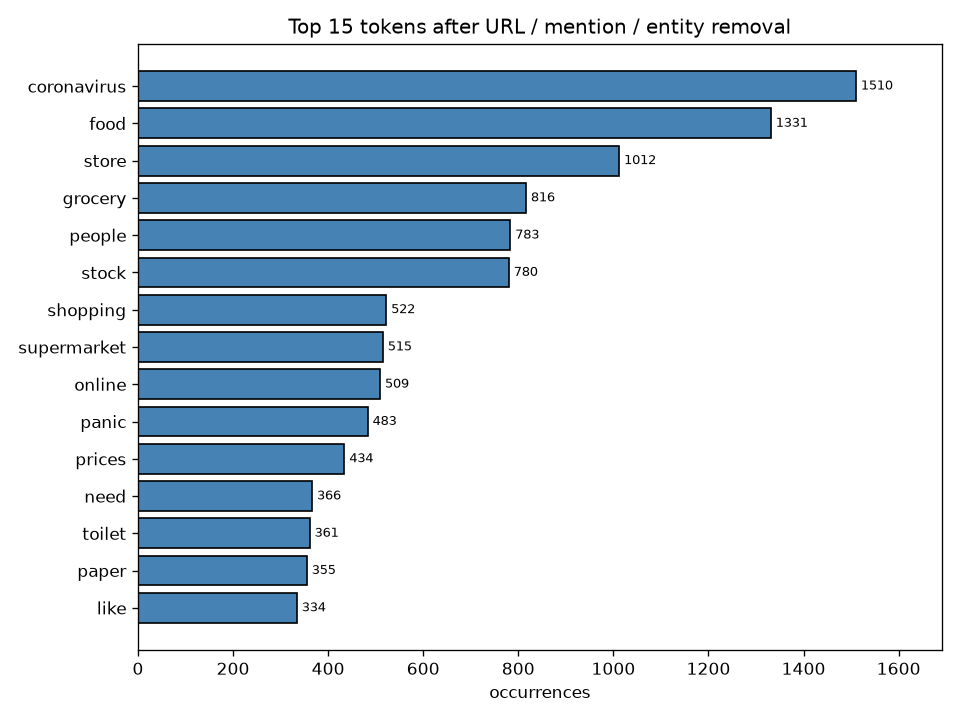
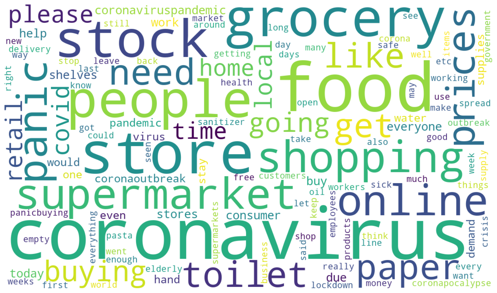
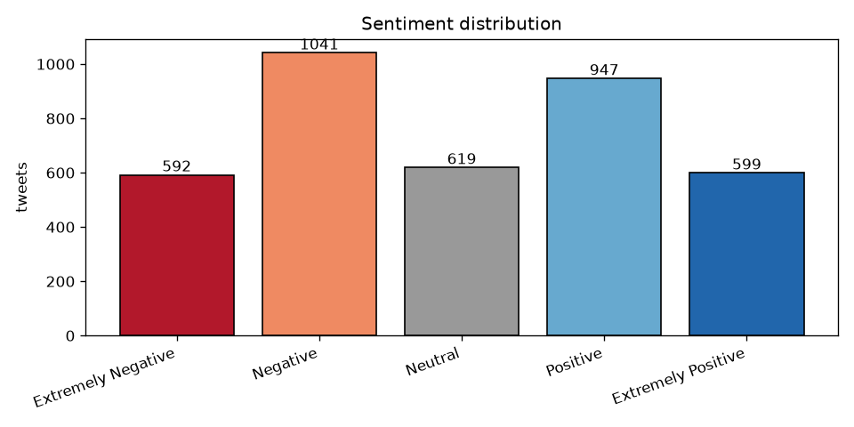

# What Were People Actually Tweeting About in Early COVID-19?

3,798 tweets from 2–16 March 2020, each hand-labelled with sentiment. What dominated the
conversation, and does the language differ between positive and negative tweets?

**[→ Read the notebook](notebooks/covid_tweet_text_analysis.ipynb)**

## Data

`data/Corona_NLP_test.csv` — the test split of the Coronavirus Tweets NLP dataset. Columns:
user, location, date, tweet text, and a five-level sentiment label.

## Method

1. Tokenise with NLTK; drop stopwords, punctuation, and tokens under 3 characters.
2. **Strip URLs, `@mentions`, and HTML entities** before tokenising — see below for why
   this is the step that matters.
3. Rank global frequencies; render a word cloud.
4. Compare negative vs. positive vocabularies with a smoothed log-ratio, restricted to
   tokens appearing ≥ 40 times.

## Findings

### 1. Preprocessing changes the answer

Tokenising the raw text and removing stopwords still leaves this:

| Rank | Token | Count |
|---|---|---|
| 1 | `https` | 1,824 |
| 2 | `coronavirus` | 1,510 |
| 3 | `food` | 1,331 |
| … | | |
| 8 | `amp` | 610 |

`https` is the single most frequent token in the corpus, and `amp` is an un-decoded `&`.
Neither is a topic. Reported as-is, they'd be findings about nothing. Stripping URLs,
mentions, and entities is the highest-leverage step in the whole pipeline.

### 2. The conversation was about groceries, not medicine

After cleaning, the top tokens are `coronavirus` (1,510), `food` (1,331), `store` (1,012),
`grocery` (816), `people` (783), `stock` (780), `shopping` (522), `supermarket` (515) —
with `panic`, `prices`, and `toilet`/`paper` close behind. In early March 2020 this sample
is overwhelmingly about **supply, not symptoms**.

### 3. Sentiment splits on emotional register, not subject

| More characteristic of **negative** | | More characteristic of **positive** | |
|---|---|---|---|
| `sick` | +2.23 | `thank` | −3.37 |
| `paid` | +2.12 | `support` | −3.02 |
| `crisis` | +2.12 | `best` | −2.86 |
| `fear` | +2.09 | `safe` | −2.82 |
| `stop` | +2.00 | `great` | −2.65 |
| `emergency` | +1.98 | `small` (business) | −2.35 |
| `panic` | +1.61 | `business` | −2.07 |
| `empty` | +1.44 | `help` | −1.72 |

*(log₂ ratio of within-class rates; positive = negative-leaning)*

Negative tweets speak the language of **shortage and alarm**. Positive tweets speak the
language of **community response** — gratitude, safety, small business support. Both
classes are discussing the same shops; what differs is the register.

## Limitations

- This is the ~3.8k-row **test split**, not the full ~44k dataset. Frequencies are
  indicative, not definitive.
- Sentiment labels are pre-assigned in the source data. This notebook analyses them; it
  does not validate or reproduce them.
- Frequency analysis finds **topics, not stance**. A word being common in negative tweets
  does not make the word negative.
- No lemmatisation, so `price`/`prices` and `store`/`stores` count separately.
- Tweets skew English-language and toward users who geotag; this is not a general
  population sample.

## Outputs

`results/sentiment_distribution.png` · `results/top_tokens.png` · `results/wordcloud.png`
