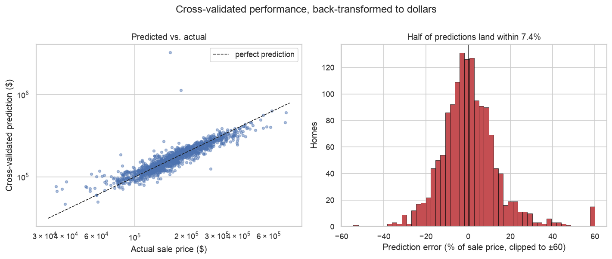

# What Is a House Worth, and How Sure Can We Be?

The Ames housing dataset records 1,460 home sales with 79 descriptive features. Thirty-six
of those are plain numbers — square footage, room counts, year built. How much of a sale
price can those numbers alone explain?

The second question turned out to matter more than the first: **how confident should
anyone be in whatever figure comes back?**

**[→ Read the notebook](notebooks/housing_price_regression.ipynb)**

## Data

1,460 sales in Ames, Iowa, 2006–2010. Not redistributed — see
[`data/README.md`](data/README.md) for a one-line download.

## Method

1. Log-transform `SalePrice` (skew 1.88 → 0.12) so linear regression's symmetric-error
   assumption holds.
2. Median-impute the three columns with gaps, standardise, fit ordinary least squares —
   all inside a pipeline, so imputation and scaling are refit within each fold.
3. Score with **five-fold cross-validation** against a **predict-the-mean baseline**, and
   back-transform predictions to dollars before reporting error.
4. Re-run the original single-split evaluation under 20 random seeds to see how much the
   reported number depends on the seed.

## Findings

| Model | R² (log price) | Median abs. error | MAE |
|---|---|---|---|
| Baseline — predict the mean | −0.00 | 25.4% | $55,655 |
| `GarageArea` only | 0.42 | 16.7% | — |
| `OverallQual` only | 0.67 | 13.1% | — |
| **All 36 numeric features** | **0.83** | **7.4%** | **$20,137** |

Half of all predictions land within **7.4%** of the true sale price — about ±$12k on a
median $163k home.

### A single train/test split cannot support a reported score here

The original analysis fit on one `train_test_split(..., random_state=0)` and reported the
R² that came back. Running the identical procedure under 20 different seeds:

**R² ranges from 0.626 to 0.907 — a spread of 0.28 — with nothing changing but the seed.**
Seed 0, the original's choice, happened to give 0.708.

That spread is larger than the gain from any modelling decision in this notebook. Someone
who tried three seeds and reported the best would appear to have improved the model
substantially while changing nothing. The cross-validated figure of 0.829 sits inside the
range and doesn't move, because every house is held out exactly once.

### Dollar RMSE is worse than the baseline, and that's informative

Every metric improves against the baseline except root-mean-squared error in dollars,
which rises from $80,702 to $88,821.

Squared error is dominated by the largest misses, and back-transforming from log space
turns a moderate log-scale error on an expensive home into an enormous dollar error. The
single worst case is house 1298 — 5,642 sq ft, quality 10, sold for $160,000 — which the
model prices at $3.25M. It is a known partial sale in this dataset, priced far below what
its features imply.

So the model is much better than baseline on a typical house and much worse on a handful
of atypical ones. No single summary statistic shows both.

### One assessor's judgement carries most of the signal

`OverallQual` — a single subjective 1–10 rating — reaches R² = 0.67 on its own, about
four-fifths of what all 36 features achieve together.

### Removing outliers raises the score without improving the model

The original filtered rows where any feature had |z| > 3. R² rises 0.83 → 0.90. That
filter discards **30% of the data** (1,021 of 1,460 rows survive) — requiring 36
simultaneous z-scores below 3 removes every genuinely large, old, or unusual house in
Ames, not just data-entry errors.

The higher number answers an easier question: predicting prices for ordinary houses only.
For valuing arbitrary homes, the honest score is 0.83.

## Limitations

- **Only numeric columns are used.** `Neighborhood` — which any realtor would call the
  dominant factor — is categorical and excluded. Encoding it would likely help materially.
- **Linear and additive.** Quality and size almost certainly interact; this model can't
  represent that.
- **Correlated predictors.** `GarageCars` and `GarageArea` measure nearly the same thing,
  so they split a shared effect arbitrarily. Coefficient *ranking* is suggestive;
  individual magnitudes are not stable.
- **Ames, Iowa, 2006–2010** — a window spanning the housing crash. Nothing here transfers
  to another market or decade.
- Errors above roughly $400k are large enough that the model shouldn't be used there.

## Next step

Add `Neighborhood` and the other ordinal quality ratings via one-hot and ordinal encoding,
and compare against a gradient-boosted tree, which handles interactions without being told
about them. Both should be scored the same way — cross-validated, against the same
baseline.

## Outputs

- `results/price_distribution.png` — raw vs. log target
- `results/predicted_vs_actual.png` — cross-validated predictions and the error distribution
- `results/split_variance.png` — R² across 20 split seeds
