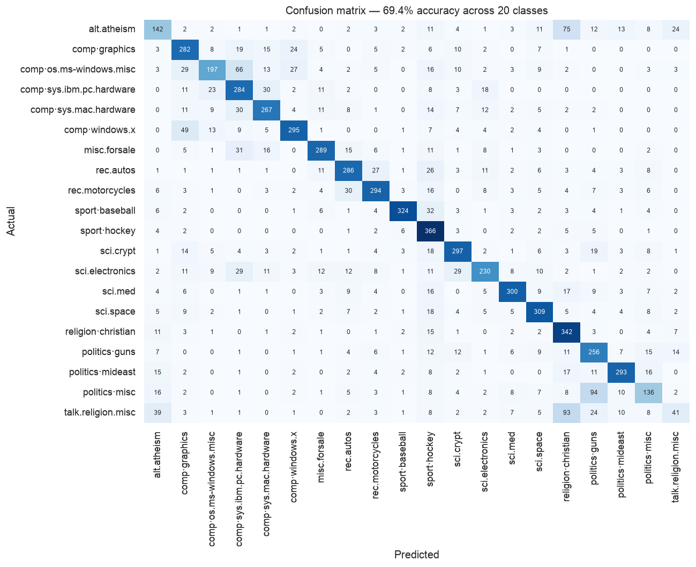

# A Text Classifier That Was Reading the Wrong Thing

Can a bag-of-words model sort Usenet posts into the twenty newsgroups they came from?

The original coursework answer was six lines of scikit-learn: TF-IDF, multinomial Naive
Bayes, print the accuracy. It reported **77.4%** across twenty classes, which sounds
respectable.

Most of that score came from metadata.

**[→ Read the notebook](notebooks/newsgroup_text_classification.ipynb)**

## Data

The **20 Newsgroups** corpus — 11,314 training and 7,532 test documents across 20 groups,
downloaded automatically by `sklearn.datasets.fetch_20newsgroups` on first run (~14 MB,
cached). The train/test split is chronological: test posts were written after training
posts.

## Method

1. Reproduce the original pipeline exactly.
2. Re-run it with `remove=('headers', 'footers', 'quotes')` and measure the difference.
3. Inspect the highest-weight features to see what the model was keying on.
4. Rebuild on text alone — stopword removal, `min_df`, sublinear TF — and tune the
   smoothing parameter by cross-validation **on the training set only**.
5. Break the result down per class and look at where it fails.

## Findings

| | accuracy |
|---|---|
| Baseline — most frequent class | 5.3% |
| **Original: TF-IDF + Naive Bayes, documents as shipped** | **77.4%** |
| Same model, metadata stripped | 60.6% |
| **Tuned TF-IDF + Naive Bayes on text alone** | **69.4%** |

### 16.8 points came from metadata leakage

The 20 Newsgroups documents ship with email headers, signature footers, and quoted reply
text attached. A typical document begins:

```
From: lerxst@wam.umd.edu (where's my thing)
Subject: WHAT car is this!?
Nntp-Posting-Host: rac3.wam.umd.edu
Organization: University of Maryland, College Park
```

A bag-of-words model doesn't know these are metadata. To it, `wam.umd.edu` is a token that
happens to predict a class very well. Stripping headers, footers, and quotes drops the
same model from 77.4% to 60.6% — **21.7% of the reported score was leakage**, and it was
information that won't exist at prediction time for any real use of this classifier.

### The leaked features are visible directly

Highest-weight features for `alt.atheism`:

| documents as shipped | metadata stripped |
|---|---|
| **`keith`**, `edu`, `god`, `caltech`, `atheists`, `livesey`, `com`, `atheism`, `sgi` | `god`, `people`, `don`, `think`, `atheism`, `religion`, `just`, `say`, `atheists`, `islam` |

The top feature is a prolific poster's first name, followed by an institution
(`caltech`), a surname (`livesey`), and a workstation vendor (`sgi`).
`talk.religion.misc` leans on `sandvik` and `kent` — two more posters.

Stripped, the subject matter takes over. The second model is doing topic classification.
The first was substantially doing **author and institution identification**, and scoring
well for it.

### Recovering the loss honestly reaches 69.4%

Stopword removal, `min_df=2`, sublinear TF scaling, and cross-validated smoothing
(`alpha = 0.03`, down from the default 1.0) recover nearly nine points over the naive
stripped model — none of it borrowed from the test set.

Linear SVM (69.2%) and logistic regression (69.4%) land in the same place, which suggests
the ceiling is in the features rather than the classifier.

Note the gap between cross-validated training accuracy (**76.0%**) and test accuracy
(**69.4%**). That's not overfitting to the hyperparameter — it's the chronological split
doing its job, as topic vocabulary drifts between periods. A random split would have
hidden this and reported a friendlier number.

### Every top confusion is between genuinely adjacent groups


| actual | predicted | count |
|---|---|---|
| `talk.politics.misc` | `talk.politics.guns` | 94 |
| `talk.religion.misc` | `soc.religion.christian` | 93 |
| `alt.atheism` | `soc.religion.christian` | 75 |
| `comp.os.ms-windows.misc` | `comp.sys.ibm.pc.hardware` | 66 |
| `comp.windows.x` | `comp.graphics` | 49 |

`talk.religion.misc` has the worst F1 in the set (0.236, recall 0.163) and cannot really
do better. It's a catch-all whose posts discuss Christianity and atheism using the same
vocabulary as the two dedicated groups — no bag-of-words feature separates "a post about
Christianity" from "a post in the Christianity group."



**This is a ceiling imposed by the label taxonomy, not by the model.** A classifier
reaching 95% here would be suspicious, and the first thing to check would be leakage of
the kind found above.

## Limitations

- **Bag of words discards order.** "Not a problem" and "a problem, not" are identical to
  this model. Bigrams would recover a little; a sequence model more.
- **Naive Bayes assumes conditional independence between tokens**, which is plainly false
  for text. It works anyway — a well-known and still slightly awkward fact.
- **Twenty classes of 1990s Usenet.** Vocabulary, topics, and posting conventions have all
  moved on. Nothing transfers to modern text without retraining.
- **`alpha` is the only hyperparameter tuned.** Vectoriser settings were chosen by
  reasoning rather than searched; a joint search would likely do better.
- Accuracy is reported on the official test set, which is appropriate here only because
  the hyperparameter search never touched it.

## Next step

Add bigrams and character n-grams, which should help most on the `comp.*` groups where
distinguishing terms are multi-word. Separately: collapse the taxonomy to the six
top-level categories and re-measure — that isolates how much of the 30% error is the model
and how much is the label scheme.

## Outputs

- `results/class_distribution.png`
- `results/confusion_matrix.png`
- `results/per_class_recall.png`
