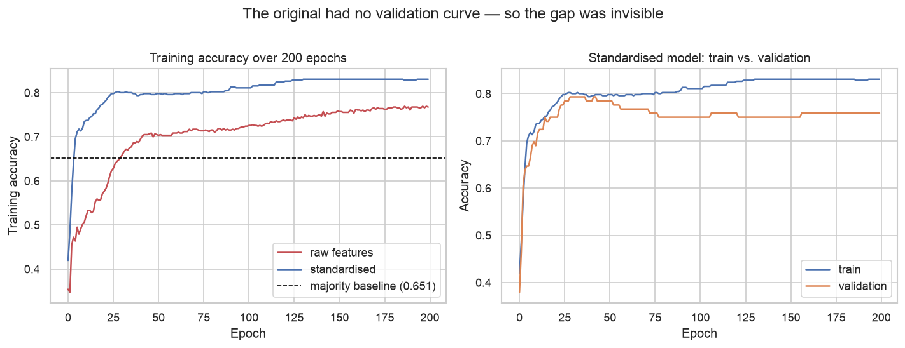
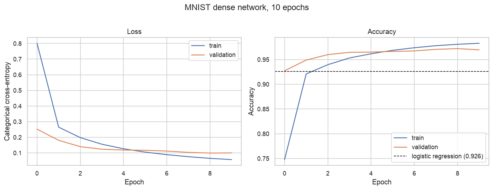
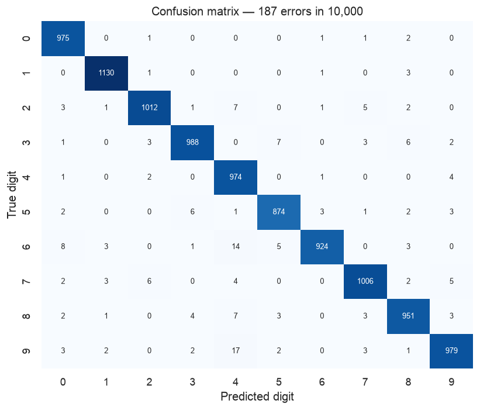

# What Does a Neural Network Actually Buy You?

A neural network is a more flexible model than logistic regression. When does that
flexibility pay for itself?

This project trains the same kind of model — a fully-connected feed-forward network — on
two deliberately different problems, and in both cases compares it against a linear model
scored the same way.

| | rows | features | feature type |
|---|---|---|---|
| **Pima diabetes** | 768 | 8 | curated clinical measurements |
| **MNIST digits** | 70,000 | 784 | raw pixel intensities |

**[→ Read the notebook](notebooks/neural_network_fundamentals.ipynb)**

## Data

- **Diabetes** — the same 768 patients used by
  [project 03](../03-diabetes-sampling-bootstrap/), read directly from that project's
  `data/` directory. Using one copy makes the comparison between a classical and a neural
  treatment of the same dataset explicit.
- **MNIST** — downloads automatically via `keras.datasets.mnist` on first run.

## Method

1. Establish a floor (majority class) and a linear reference (logistic regression) for
   each dataset, scored the same way as the network.
2. Reproduce the original coursework network faithfully, with only Keras 3 API updates.
3. Fix what's wrong with it, measuring each fix separately.
4. Compare like with like — five-fold stratified cross-validation on diabetes, a held-out
   test set on MNIST.

## Findings

| | diabetes (768×8) | MNIST (60,000×784) |
|---|---|---|
| Majority / constant baseline | 65.1% | ~10% |
| Logistic regression | **77.5%** | 92.6% |
| Neural network | 76.0% | **96.8%** |

**The deciding factor is not the model. It's how much data there is and how raw the
features are.**

### On diabetes, the network does not beat logistic regression

Cross-validated, the two are within a hundredth of each other on ROC AUC (0.832 vs 0.830)
and the accuracy gap is smaller than the fold-to-fold standard deviation.

That isn't a failure of the network — it's what 768 rows and 8 clinician-chosen features
can support. The MLP has 201 parameters against roughly 490 training rows per fold, and
the eight features were selected precisely because they relate to the outcome in simple
ways. There is no additional structure for extra capacity to find.

### The original network scored 68.8% — under four points above guessing

Its cause was feeding unscaled features to gradient descent. `Insulin` runs to 846 while
`DiabetesPedigreeFunction` stays under 2.5, so the optimiser takes wildly unequal steps
per feature. Standardising the inputs — one line — moved test accuracy from 68.8% to
77.1%, **+8.3 points from a preprocessing change**.



The right panel is the reason to always hold out a validation split. The original plotted
only the training curve, which rises reassuringly and says nothing about generalisation.

### On MNIST the network wins clearly

96.8% against 92.6% — a gap of 4.2 points that cuts the error rate from 7.4% to 3.2%, well
over half the remaining errors. Sixty thousand examples and raw pixels are exactly the
conditions extra capacity needs.



### Training on the test set inflated accuracy by 3.0 points

The original contained:

```python
history = model.fit(train_data, train_labels_one_hot, batch_size=256, epochs=10, verbose=0)
his2     = model.fit(test_data,  test_labels_one_hot,  batch_size=256, epochs=10, verbose=0)
```

The second call continues training **the same model** on the test set. Every evaluation
after it reports performance on memorised data.

Measured rather than asserted: honest accuracy 96.8%, accuracy after the second `fit`
**99.8%**. Three points of pure fiction, pointing in the flattering direction.

The number matters less than the shape of the failure. It's silent, it moves the metric
the right way, and nothing in the output distinguishes it from a real improvement. Only
reading the code finds it.

### Smaller fixes

- **Sigmoid → ReLU** in the hidden layers: +1.3 points. Sigmoids saturate, and the
  gradient vanishes for inputs far from zero.
- The original's Functional API section referenced `x_train` and `y_train`, which were
  never defined — that code could not have run. It's completed in the notebook, using
  logits with `from_logits=True` for numerical stability.

### Where the errors actually are



Errors concentrate in a few pairs, several of them the classic ambiguities — 9 read as 4
(17 cases), 3 as 5. Accuracy alone would not have shown this structure.

## Limitations

- **The architectures are the coursework's, not tuned.** Layer widths, depth, and epoch
  counts were fixed in advance. A tuned network might edge past logistic regression on
  diabetes; the point is that it isn't free and the default didn't.
- **Single training run per configuration** on MNIST. Results vary with initialisation;
  the seed is pinned, but read the numbers as approximate to a few tenths of a point.
- **MNIST test accuracy is reported on the official test set**, used repeatedly across the
  notebook for comparison. In a real project those comparisons belong on a validation
  split, with the test set touched once.
- **A dense network is the wrong tool for images** — flattening discards spatial
  structure. [Project 09](../09-cifar10-cnn/) takes that up with convolutions.
- The diabetes dataset encodes biological zeros as missing (`Insulin = 0`, `BMI = 0`),
  left uncorrected here so the comparison to the original stays honest. It affects both
  models equally.

## Next step

The diabetes result suggests the ceiling is the data, not the model. Testing that would
mean a learning curve — accuracy against training-set size — to see whether the two models
are converging or whether the network is still data-starved at n = 768.

## Outputs

- `results/diabetes_training_curves.png`
- `results/mnist_samples.png`
- `results/mnist_training_curves.png`
- `results/mnist_confusion_matrix.png`
- `results/mnist_errors.png`
