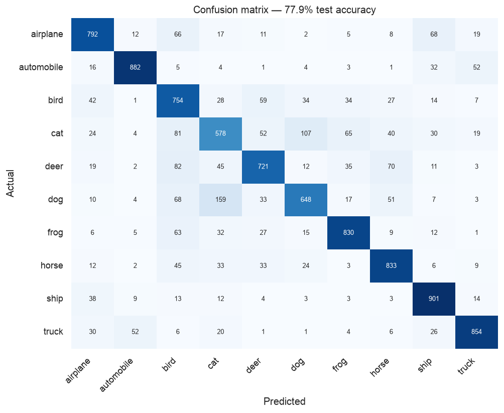
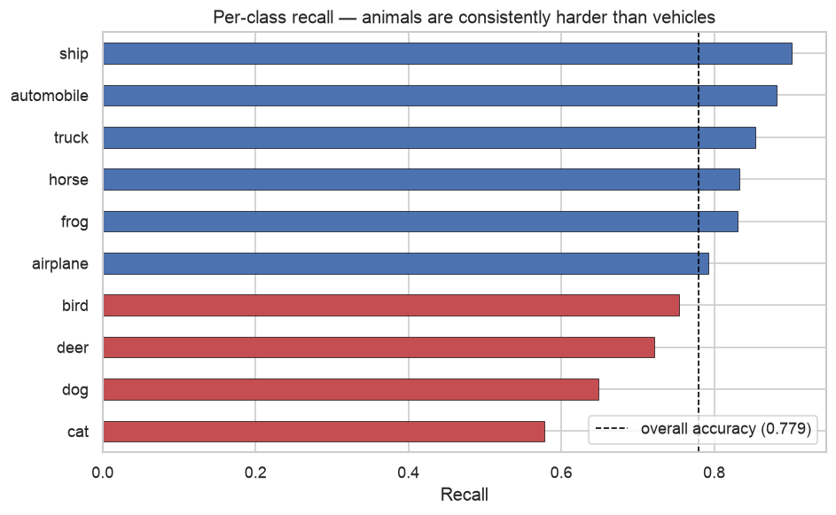

# Does Convolution Earn Its Complexity?

[Project 08](../08-neural-network-fundamentals/) ended by noting that a dense network is
the wrong tool for images: flattening a picture into a vector throws away the fact that
neighbouring pixels are related. This project tests that claim on CIFAR-10 — 60,000
colour photographs across ten classes — and measures what convolution is actually worth
against two references scored the same way.

| | rows | input | classes |
|---|---|---|---|
| **CIFAR-10** | 60,000 | 32×32×3 = 3,072 values | 10 |

**[→ Read the notebook](notebooks/cifar10_cnn.ipynb)**

## Data

CIFAR-10 downloads automatically via `keras.datasets.cifar10` on first run (~170 MB).
Nothing is redistributed here.

## Method

1. Split three ways — 45,000 train / 5,000 validation / 10,000 test — and keep the test
   set out of every training and stopping decision.
2. Establish two baselines: logistic regression on raw flattened pixels, and project 08's
   dense network applied to the same 3,072 inputs.
3. Reproduce the coursework's convolutional architecture, with only Keras 3 API updates.
4. Train with early stopping on the *validation* split, then evaluate once on the test
   set.

## Findings

| model | test accuracy | parameters |
|---|---|---|
| Logistic regression (raw pixels) | 35.65% | 30,730 |
| Dense network (project 08 architecture) | 46.36% | 2,103,818 |
| **Convolutional network** | **77.93%** | 2,915,114 |

**Convolution is worth 31 points over a dense network on identical data.** The dense
network, in turn, is worth only 11 points over logistic regression for two million
parameters. Depth alone does very little here — the architecture has to match the
structure of the data.

### The 31 points cost 287,008 parameters

The six convolutional layers hold **287,008 parameters — 9.8% of the model**, and they
are what carries accuracy from 46% to 78%. A convolutional filter is 3×3×channels of
weights reused at every position in the image, where a dense layer needs a separate weight
per input pixel. That weight sharing is the whole mechanism: a filter that detects an edge
detects it anywhere in the frame.

The CNN's *total* is larger than the dense baseline's, and it is worth being precise about
why. The two inherited dense layers on top — 1,024 and 512 units over a flattened
2,048-element feature map — carry roughly **90% of the weights** and contribute almost
nothing. Replacing that head with global average pooling would shrink the model by close
to an order of magnitude and would likely *improve* the generalisation gap below. That is
the obvious next experiment, and it is not one the coursework architecture makes.

### Early stopping ended training at 23 of 70 permitted epochs

| | |
|---|---|
| final train accuracy | 91.20% |
| final validation accuracy | 78.64% |
| generalisation gap | **+0.126** |
| held-out test accuracy | 77.93% |

Validation loss stopped improving around epoch 15 while training accuracy kept climbing —
the model is memorising, not running out of capacity. Training ran 11.4 minutes on CPU at
roughly 30 s per epoch.

### The original's 82.13% is not reproduced, and not reported

The source notebook carried a note reading *"the accuracy changed from 70.31% to 82.13%"*
after architecture tuning, from a 70-epoch run on Colab's GPU. Neither figure appears as a
result here.

The original passed `validation_data=(X_test, y_test)` to `fit()`, watched that curve for
70 epochs, and then reported `model.evaluate(X_test, y_test)`. No gradient is computed
from validation data, so this is not project 08's train-on-test bug. It is subtler: every
stopping and architecture decision was made by reading the test set, and the reported
figure was the better of at least two attempts scored against it. The number is a
selection artefact before it is a hardware one, so the two are not comparable even setting
the GPU aside.

### Animals are consistently harder than vehicles

| actual | predicted | count |
|---|---|---|
| dog | cat | 159 |
| cat | dog | 107 |
| deer | bird | 82 |
| cat | bird | 81 |
| deer | horse | 70 |
| airplane | ship | 68 |

Automobiles, ships, and trucks have rigid shapes, consistent orientations, and
characteristic backgrounds — road, water, sky. Cats, dogs, deer, and birds are deformable,
photographed from any angle, and share the same outdoor settings as each other. Cat and
dog is the single hardest pair, which is the standard result on this dataset.

## Limitations

- **No data augmentation.** Random flips and crops are the standard next step on CIFAR-10
  and would likely add several points, since the generalisation gap shows the model is
  memorising rather than starved of capacity.
- **Early stopping ended training at 23 epochs**, not the 70 the original ran. The
  accuracy reported is what this configuration produced, not a ceiling for the
  architecture.
- **No architecture search.** Filter counts, dropout rates, and the two large dense layers
  are all inherited from the coursework.
- **32×32 images.** Conclusions about what convolution buys do not automatically scale to
  full-resolution photographs.
- **Not equal-compute.** The dense baseline was given 20 epochs rather than the CNN's
  schedule. It had plateaued well before then, but the comparison is not matched on
  budget.
- **Single run per configuration**, on CPU. Read the numbers as approximate to a few
  tenths of a point.

## Next step

Add random horizontal flips and small translations and re-run otherwise unchanged. If the
generalisation gap is the binding constraint, that alone should close a meaningful part of
the distance to the original's claimed figure — measured, this time, on a test set that
played no part in training.

## Outputs

- `results/cifar10_samples.png`
- `results/training_curves.png`
- `results/confusion_matrix.png`
- `results/per_class_recall.png`
- `results/errors.png`
