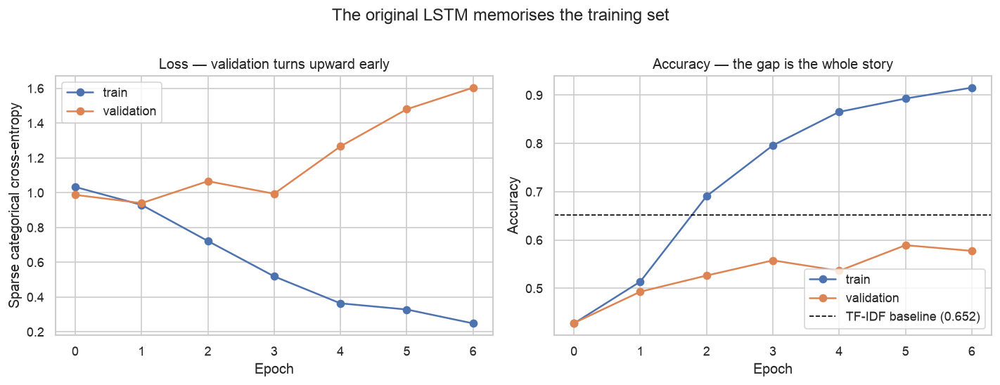
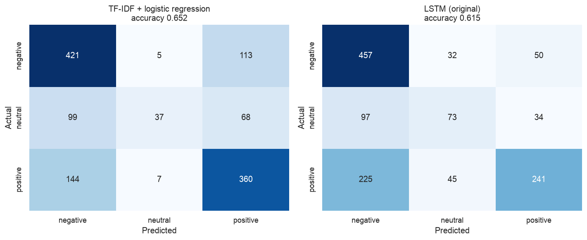

# Does Reading Word Order Help?

[Project 04](../04-covid-tweet-text-analysis/) analysed 3,798 COVID-19 tweets by counting
words — tokenise, strip stopwords, compare frequencies between sentiment classes. That
throws away word order entirely: *"not worried at all"* and *"worried, not at all"* are
the same bag of words.

An LSTM reads a tweet as a sequence, one token at a time, carrying state forward. In
principle it can represent negation, intensifiers, and phrase structure that counting
cannot. This project asks whether that helps — on the same tweets, scored the same way.

**[→ Read the notebook](notebooks/tweet_sentiment_lstm.ipynb)**

## Data

The COVID-19 tweet corpus already committed for
[project 04](../04-covid-tweet-text-analysis/) — 3,798 tweets, five sentiment labels
collapsed to three (negative / neutral / positive), split 2,544 train / 1,254 test.

> **Dataset substitution.** The original coursework read `Sentiment.csv`, a Kaggle
> GOP-debate tweet set loaded from a Colab path. That file isn't present in any source
> repository or submission archive and isn't redistributable here. Using project 04's
> corpus keeps the task identical — multi-class sentiment on short social text — and makes
> this a direct comparison between counting words and reading them in order **on the same
> tweets**. The architecture, preprocessing, and training procedure are carried over
> unchanged.

## Method

1. Establish a floor (majority class) and a strong cheap reference (TF-IDF with bigrams +
   logistic regression).
2. Reproduce the coursework LSTM, with only Keras 3 API updates.
3. Give it a validation split — the original had none — and read the curves.
4. Try twice to rescue it: smaller and regularised, then bidirectional.

## Findings

| model | test accuracy | parameters |
|---|---|---|
| Majority class | 43.0% | 0 |
| **TF-IDF + logistic regression** | **65.2%** | 35,745 |
| LSTM (original architecture) | 61.5% | 511,391 |
| LSTM (smaller + regularised) | 62.2% | 161,219 |
| Bidirectional LSTM | 60.5% | 194,435 |

**No. Every sequence model loses to the bag of words.**

Three configurations spanning an order of magnitude in capacity all land in a three-point
band below TF-IDF — and the best of them is the one with the *fewest* parameters. Cutting
capacity helped; adding it (the bidirectional model, which has the better inductive story
for sentiment) finished last. That ordering is what makes the conclusion credible: this is
a data-volume ceiling, not one unlucky architecture.

The baseline uses unigrams **and bigrams**, so it captures a little local order — `not
good` is its own feature. That is the fair comparison. The question is whether a recurrent
model's general sequence handling beats cheap n-grams, not whether it beats pure unigrams.

### The original LSTM memorises the training set

| | |
|---|---|
| final training accuracy | 91.6% |
| final validation accuracy | 57.8% |
| gap | **+0.338** |

511,391 parameters against 2,035 training tweets — roughly **250 parameters per training
example**. Validation loss bottoms out at epoch two and trends upward from there.

**The original had no validation split at all**, so none of this was visible. It ran a
fixed seven epochs and reported the accuracy at epoch seven — well past the point where
the model started getting worse.

### `neutral` is the hardest class, and the two models fail differently

| `neutral` | precision | recall |
|---|---|---|
| TF-IDF + logistic regression | 0.755 | 0.181 |
| LSTM | 0.487 | 0.358 |

The linear model is cautious — it predicts `neutral` only when confident, buying high
precision at the cost of finding barely a fifth of them. The LSTM guesses `neutral` more
freely, catches twice as many, and pays for it elsewhere (positive recall falls to 0.472).

Neutral is genuinely the hardest label. Negative and positive tweets carry characteristic
vocabulary; neutral ones are defined by the *absence* of it, which is a much weaker signal
for either model.

### Saving and loading

Because `TextVectorization` is a layer *inside* the model, the saved `.keras` artefact
carries its own vocabulary — no separate tokeniser pickle to keep in sync, and raw strings
go straight in. Accuracy before saving and after loading match exactly (0.6148), asserted
in the notebook rather than eyeballed.

On four held-out sentences the model reads `"not happy with how this is being handled at
all"` as negative with 0.980 confidence — exactly the construction a unigram bag of words
cannot represent. It's a fair illustration and no more than that: across 1,254 test tweets
the same model still finishes three and a half points below the model that cannot
represent negation at all.

## Limitations

- **3,798 tweets is small.** The full Coronavirus Tweets dataset has roughly 41,000
  training rows; this repository ships only the test split. Ten times the data is the
  single change most likely to reverse the conclusion.
- **No pretrained embeddings.** The embedding layer is learned from scratch on 2,035
  tweets. GloVe or a transformer encoder would bring outside language knowledge, and is
  the standard fix for exactly this situation.
- **Single run per configuration.** Neural results vary with initialisation; the seed is
  pinned, but treat differences under a point or so as noise — including the gap between
  the three LSTM variants.
- **The labels are annotator judgements** on short, ambiguous text. Some fraction of the
  remaining error is disagreement no model can resolve.
- **Collapsing five classes to three** discards intensity information the original data
  carried.
- The test set is used to compare five models, so the reported figures are mildly
  optimistic as estimates of performance on genuinely new data.

## Next step

Fine-tune a small pretrained transformer on the same split. If a model with outside
language knowledge clears 65.2% comfortably, that confirms the ceiling here is corpus size
rather than the task.

## Outputs

- `results/lstm_training_curves.png`
- `results/model_comparison.png`
- `results/confusion_matrices.png`
- `notebooks/tweet_sentiment_lstm.keras` — saved model, gitignored and regenerated on run
