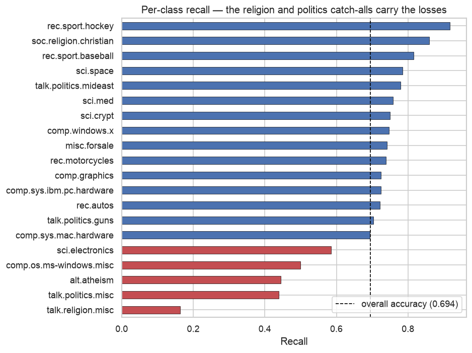

# Data Analysis Portfolio

Seven self-contained analyses in Python — statistical inference, exploratory data
analysis, resampling, natural language processing, regression, text classification, and
unsupervised machine learning. Each project states a question up front, shows the work,
and ends with findings and their limitations.

Every notebook runs top to bottom from a clean checkout (see [Setup](#setup)). Projects 02
and 05 use datasets that aren't redistributable; each has a `data/README.md` with a
one-line download.

---

## Projects

### [01 · Do height and weight predict grip strength?](01-health-metrics-correlation/)
Correlation analysis with confidence intervals on a 10-observation health dataset.

The interesting result is a negative one: no predictor reaches significance, and every
95% interval spans zero. The notebook makes the case that the limiting factor is **sample
size, not effect size** — at *n* = 10 the interval on *r* is roughly ±0.65 regardless of
the data, so "we can't tell" is the only honest conclusion.

`pandas` · `scipy.stats` · `matplotlib`


---

### [02 · What predicts student exam performance?](02-student-performance-eda/)
Exploratory analysis of 1,000 students across gender, parental education, lunch type, and
test preparation.

Test preparation shows the clearest separation — and it's the only variable in the dataset
a school can actually act on. Lunch type (a socioeconomic proxy) separates the
distributions nearly as sharply.

`pandas` · `matplotlib` · `seaborn`

> The source CSV isn't redistributed here — see [`data/README.md`](02-student-performance-eda/data/README.md)
> for a one-line download. Saved plots are preserved so the analysis reads without it.

---

### [03 · How well does a small sample represent its population?](03-diabetes-sampling-bootstrap/)
Sampling and bootstrap resampling against the 768-patient Pima Diabetes dataset, treated
as a known population.

A single 25-patient sample overstates mean glucose by **7.8%**. Bootstrapping — 500
resamples of 150 — recovers every blood-pressure statistic to within **0.9%**. The
notebook also shows that extremes (max) survive small samples well while central tendency
does not.

`pandas` · `numpy` · `seaborn`


---

### [04 · What were people tweeting about in early COVID-19?](04-covid-tweet-text-analysis/)
NLP on 3,798 tweets from March 2020: tokenisation, stopword removal, frequency analysis,
and a sentiment-split comparison.

Naive tokenisation makes `https` the most common token in the corpus — an artefact, not a
topic. After stripping URLs, mentions, and HTML entities, the real subject emerges:
**grocery supply**, not medicine. A log-ratio comparison then splits the vocabulary by
sentiment — `panic`, `fear`, `crisis`, `empty` on one side; `thank`, `support`, `safe`,
`small business` on the other.

`nltk` · `pandas` · `wordcloud` · `matplotlib`


---

### [05 · Segmenting credit-card customers with PCA and K-means](05-credit-card-customer-segmentation/)
Unsupervised clustering of 8,950 customers, scored by silhouette across raw, standardised,
and PCA-reduced feature spaces.

Raw features give the **highest** silhouette score — and the least useful clustering. Six
features are bounded in [0, 1] while `TENURE` runs 6–12, so that one feature dominates the
distance metric and K-means effectively clusters on tenure alone. Silhouette rewards the
resulting tight bands. The project's point is that **a higher score is not automatically a
better model**, and that silhouette is only comparable within the space the model was fitted in.

`scikit-learn` · `pandas` · `matplotlib`

> Dataset not redistributed — see [`data/README.md`](05-credit-card-customer-segmentation/data/README.md).
> Figures generate on first run.

---

### [06 · What is a house worth, and how sure can we be?](06-housing-price-regression/)
Linear regression on 1,460 Ames home sales, using the 36 numeric features.

The model reaches **R² = 0.83** under five-fold cross-validation — a median error of 7.4%
of sale price. The more useful result concerns the evaluation: re-running the original
single-split procedure under 20 random seeds gives R² anywhere from **0.63 to 0.91**. The
seed moves the reported score further than any modelling decision in the notebook does.

Dollar RMSE also comes out *worse* than a predict-the-mean baseline while every other
metric is far better — back-transforming from log space punishes a handful of high-end
misses.

`scikit-learn` · `pandas` · `scipy`


> Dataset not redistributed — see [`data/README.md`](06-housing-price-regression/data/README.md).

---

### [07 · A text classifier that was reading the wrong thing](07-newsgroup-text-classification/)
TF-IDF and multinomial Naive Bayes across the 20 Newsgroups corpus.

The naive version scores **77.4%**. It shouldn't. The documents ship with email headers
and signature footers attached, so the highest-weight feature for `alt.atheism` is
`keith` — a prolific poster's first name — followed by `caltech`, `livesey`, and `sgi`.
Strip the metadata and the same model falls to **60.6%**: **21.7% of the reported score
was the classifier identifying authors, not topics.**

Rebuilt on text alone and tuned honestly it reaches **69.4%**, and every remaining
confusion is between genuinely adjacent groups. `talk.religion.misc` is the worst class in
the set and cannot do better — that ceiling belongs to the label taxonomy, not the model.

`scikit-learn` · `pandas` · `seaborn`



---

## What these demonstrate

| | |
|---|---|
| **Statistical inference** | Pearson correlation, Fisher *z* confidence intervals, *p*-values, power reasoning |
| **Resampling** | Bootstrap sampling distributions; estimator bias and spread |
| **Regression** | Ordinary least squares, log-target transforms, error reported in original units |
| **Model evaluation** | Cross-validation, baseline comparison, split-seed sensitivity, leakage from preprocessing |
| **Data cleaning** | Categorical encoding, URL/entity stripping, missing-data handling |
| **NLP** | Tokenisation, stopword removal, frequency analysis, log-ratio class comparison |
| **Text classification** | TF-IDF weighting, multinomial Naive Bayes, linear SVM, per-class precision and recall |
| **Leakage detection** | Finding and quantifying metadata leakage in a reported score |
| **Hyperparameter tuning** | Grid search cross-validated on training data only |
| **Unsupervised ML** | K-means, PCA, silhouette scoring, elbow method, feature scaling |
| **Visualisation** | Distribution comparison, annotated multi-panel figures, word clouds |
| **Analytical judgment** | Reporting what the data *can't* support, and stating limitations |

## Setup

```bash
git clone https://github.com/m-nweke/data-analysis-portfolio.git
cd data-analysis-portfolio
python3 -m venv .venv && source .venv/bin/activate
pip install -r requirements.txt
jupyter lab
```

Notebooks read data via paths relative to their own directory, so run them from within
each project's `notebooks/` folder.

## Repository layout

```
<project>/
├── README.md      question, method, findings
├── data/          inputs (raw/ and processed/ where applicable)
├── notebooks/     the analysis
└── results/       generated figures
```

## Notes

These analyses began as graduate coursework (CS5530 / CS5531) and have since been
reworked: bugs fixed, hardcoded Colab paths removed, methodology tightened, and findings
rewritten to state their own limitations. Project 05 additionally corrects two errors in
the original that invalidated its headline comparison — see its
[README](05-credit-card-customer-segmentation/) for what changed and why it mattered.

## License

[MIT](LICENSE)
