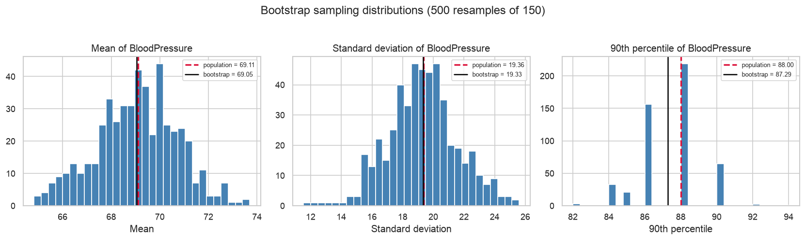
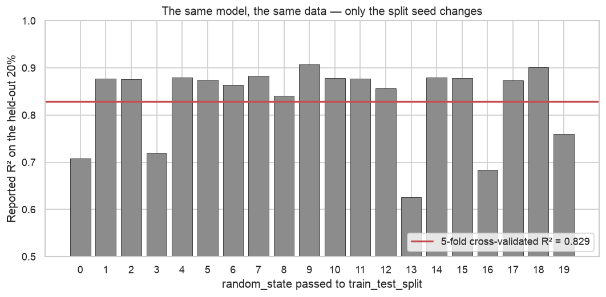
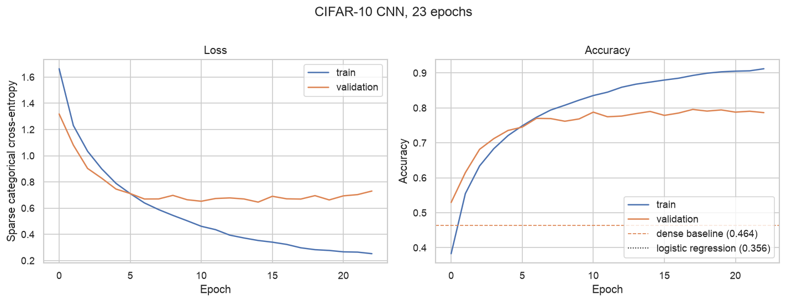
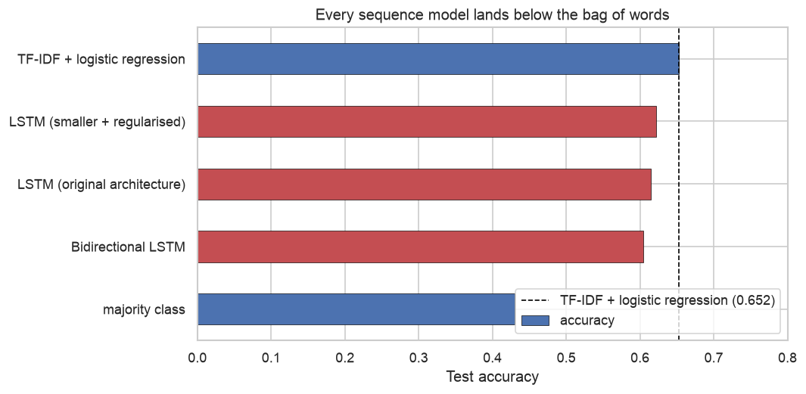

# Applied Data Science

**Projects in statistics, ML, and deep learning.**

Ten self-contained analyses in Python — statistical inference, exploratory data analysis,
resampling, natural language processing, regression, text classification, unsupervised
machine learning, deep learning, and computer vision. Each project states a question up
front, shows the work, and ends with findings and their limitations.

Every notebook runs top to bottom (see [Setup](#setup)), and all but two ship with their
outputs committed, so the analyses read without being run. Projects 03, 04, and 05 use
datasets that aren't redistributable; each has a `data/README.md` with a one-line download,
and **03 and 05 need theirs before they will produce any output.**

| | project | in one line |
|---|---|---|
| **[01](01-health-metrics-correlation/)** | Grip strength correlation | At *n* = 10, "we can't tell" is the only honest conclusion |
| **[02](02-diabetes-sampling-bootstrap/)** | Sampling and bootstrap | One 25-patient sample overstates mean glucose by 7.8% |
| **[03](03-student-performance-eda/)** | Student performance EDA | Test preparation is the clearest — and only actionable — separator |
| **[04](04-housing-price-regression/)** | Housing price regression | The random seed moves R² further than any modelling choice |
| **[05](05-credit-card-customer-segmentation/)** | Customer segmentation | The highest silhouette score comes from the least useful clustering |
| **[06](06-covid-tweet-text-analysis/)** | COVID tweet text analysis | Naive tokenisation makes `https` the corpus's top "topic" |
| **[07](07-newsgroup-text-classification/)** | Newsgroup classification | 21.7% of the reported accuracy was metadata leakage |
| **[08](08-neural-network-fundamentals/)** | Neural network fundamentals | The original trained on the test set: 3.0 points of fiction |
| **[09](09-cifar10-cnn/)** | CIFAR-10 CNN | Convolution is worth 31 points, from 9.8% of the parameters |
| **[10](10-tweet-sentiment-lstm/)** | LSTM tweet sentiment | Every sequence model loses to a bag of words |

Projects 04 and 07–10 share a through-line: each one finds a real methodological fault in
its source and **measures** what it was worth, rather than asserting it.

---

## Statistics & inference

### [01 · Do height and weight predict grip strength?](01-health-metrics-correlation/)
Correlation analysis with confidence intervals on a 10-observation health dataset.

The interesting result is a negative one: no predictor reaches significance, and every
95% interval spans zero. The notebook makes the case that the limiting factor is **sample
size, not effect size** — at *n* = 10 the interval on *r* is roughly ±0.65 regardless of
the data, so "we can't tell" is the only honest conclusion.

`pandas` · `scipy.stats` · `matplotlib`


---

### [02 · How well does a small sample represent its population?](02-diabetes-sampling-bootstrap/)
Sampling and bootstrap resampling against the 768-patient Pima Diabetes dataset, treated
as a known population.

A single 25-patient sample overstates mean glucose by **7.8%**. Bootstrapping — 500
resamples of 150 — recovers every blood-pressure statistic to within **0.9%**. The
notebook also shows that extremes (max) survive small samples well while central tendency
does not.

`pandas` · `numpy` · `seaborn`



---

## Exploratory analysis

### [03 · What predicts student exam performance?](03-student-performance-eda/)
Exploratory analysis of 1,000 students across gender, parental education, lunch type, and
test preparation.

Test preparation shows the clearest separation — and it's the only variable in the dataset
a school can actually act on. Lunch type (a socioeconomic proxy) separates the
distributions nearly as sharply.

`pandas` · `matplotlib` · `seaborn`

> The source CSV isn't redistributed here — see [`data/README.md`](03-student-performance-eda/data/README.md)
> for a one-line download. Figures generate on first run.

---

## Machine learning

### [04 · What is a house worth, and how sure can we be?](04-housing-price-regression/)
Linear regression on 1,460 Ames home sales, using the 36 numeric features.

The model reaches **R² = 0.83** under five-fold cross-validation — a median error of 7.4%
of sale price. The more useful result concerns the evaluation: re-running the original
single-split procedure under 20 random seeds gives R² anywhere from **0.63 to 0.91**. The
seed moves the reported score further than any modelling decision in the notebook does.

Dollar RMSE also comes out *worse* than a predict-the-mean baseline while every other
metric is far better — back-transforming from log space punishes a handful of high-end
misses.

`scikit-learn` · `pandas` · `scipy`



> Dataset not redistributed — see [`data/README.md`](04-housing-price-regression/data/README.md).

---

### [05 · Segmenting credit-card customers with PCA and K-means](05-credit-card-customer-segmentation/)
Unsupervised clustering of 8,950 customers, scored by silhouette across raw, standardised,
and PCA-reduced feature spaces.

Raw features give the **highest** silhouette score — and the least useful clustering. Six
features are bounded in [0, 1] while `TENURE` runs 6–12, so that one feature dominates the
distance metric and K-means effectively clusters on tenure alone. Silhouette rewards the
resulting tight bands. The project's point is that **a higher score is not automatically a
better model**, and that silhouette is only comparable within the space the model was fitted in.

`scikit-learn` · `pandas` · `matplotlib`

> Dataset not redistributed — see [`data/README.md`](05-credit-card-customer-segmentation/data/README.md).
> Figures generate on first run.

---

## Natural language processing

### [06 · What were people tweeting about in early COVID-19?](06-covid-tweet-text-analysis/)
NLP on 3,798 tweets from March 2020: tokenisation, stopword removal, frequency analysis,
and a sentiment-split comparison.

Naive tokenisation makes `https` the most common token in the corpus — an artefact, not a
topic. After stripping URLs, mentions, and HTML entities, the real subject emerges:
**grocery supply**, not medicine. A log-ratio comparison then splits the vocabulary by
sentiment — `panic`, `fear`, `crisis`, `empty` on one side; `thank`, `support`, `safe`,
`small business` on the other.

`nltk` · `pandas` · `wordcloud` · `matplotlib`


---

### [07 · A text classifier that was reading the wrong thing](07-newsgroup-text-classification/)
TF-IDF and multinomial Naive Bayes across the 20 Newsgroups corpus.

The naive version scores **77.4%**. It shouldn't. The documents ship with email headers
and signature footers attached, so the highest-weight feature for `alt.atheism` is
`keith` — a prolific poster's first name — followed by `caltech`, `livesey`, and `sgi`.
Strip the metadata and the same model falls to **60.6%**: **21.7% of the reported score
was the classifier identifying authors, not topics.**

Rebuilt on text alone and tuned honestly it reaches **69.4%**, and every remaining
confusion is between genuinely adjacent groups. `talk.religion.misc` is the worst class in
the set and cannot do better — that ceiling belongs to the label taxonomy, not the model.

`scikit-learn` · `pandas` · `seaborn`


---

## Deep learning

### [08 · What does a neural network actually buy you?](08-neural-network-fundamentals/)
The same feed-forward architecture on two deliberately different problems, each measured
against a linear model scored the same way.

| | diabetes (768×8) | MNIST (60,000×784) |
|---|---|---|
| logistic regression | **77.5%** | 92.6% |
| neural network | 76.0% | **96.8%** |

On 768 rows of curated clinical measurements the network **loses** to logistic regression.
On 60,000 images of raw pixels it cuts the error rate from 7.4% to 3.2%. The deciding
factor is data volume and feature rawness, not model class.

The original MNIST notebook also called `model.fit()` a second time on the *test* set.
Measured here rather than asserted: it inflates reported accuracy from 96.8% to **99.8%**.

`keras` · `tensorflow` · `scikit-learn`


---

### [09 · Does convolution earn its complexity?](09-cifar10-cnn/)
A convolutional network on CIFAR-10, measured against logistic regression on raw pixels
and against project 08's dense network on the same 3,072 inputs.

| model | test accuracy | parameters |
|---|---|---|
| logistic regression (raw pixels) | 35.7% | 30,730 |
| dense network (project 08) | 46.4% | 2,103,818 |
| **convolutional network** | **77.9%** | 2,915,114 |

**Convolution is worth 31 points over a dense network on identical data**, and the layers
responsible cost only **287,008 parameters — 9.8% of the model**. The total is larger only
because the two inherited dense layers on top carry ~90% of the weights and contribute
almost nothing.

The original reported 82.13%, having passed the test set as `validation_data` and watched
it for 70 epochs before reporting on it. That figure isn't reused here — the notebook
explains why it isn't comparable.

`keras` · `tensorflow` · `scikit-learn`



---

### [10 · Does reading word order help?](10-tweet-sentiment-lstm/)
An LSTM on the same COVID-19 tweets [project 06](06-covid-tweet-text-analysis/) analysed by
counting words. A bag of words treats *"not worried at all"* and *"worried, not at all"* as
identical; a sequence model does not have to.

| model | test accuracy | parameters |
|---|---|---|
| **TF-IDF + logistic regression** | **65.2%** | 35,745 |
| LSTM (original architecture) | 61.5% | 511,391 |
| LSTM (smaller + regularised) | 62.2% | 161,219 |
| Bidirectional LSTM | 60.5% | 194,435 |

**Every sequence model loses to the bag of words**, and the best of them is the one with the
fewest parameters. The original LSTM hits 91.6% on training data against 57.8% on
validation — 511,391 parameters against 2,035 tweets. The original had no validation split
at all, so it reported a fixed seventh epoch, well past where the model began getting worse.

`keras` · `tensorflow` · `scikit-learn`



---

## What these demonstrate

| | |
|---|---|
| **Statistical inference** | Pearson correlation, Fisher *z* confidence intervals, *p*-values, power reasoning |
| **Resampling** | Bootstrap sampling distributions; estimator bias and spread |
| **Regression** | Ordinary least squares, log-target transforms, error reported in original units |
| **Model evaluation** | Cross-validation, baseline comparison, split-seed sensitivity, leakage from preprocessing |
| **Data cleaning** | Categorical encoding, URL/entity stripping, missing-data handling |
| **NLP** | Tokenisation, stopword removal, frequency analysis, log-ratio class comparison |
| **Text classification** | TF-IDF weighting, multinomial Naive Bayes, linear SVM, per-class precision and recall |
| **Sequence models** | Recurrent networks, embeddings, `TextVectorization` inside the model, capacity against corpus size |
| **Leakage detection** | Finding and quantifying metadata leakage in a reported score |
| **Hyperparameter tuning** | Grid search cross-validated on training data only |
| **Unsupervised ML** | K-means, PCA, silhouette scoring, elbow method, feature scaling |
| **Deep learning** | Keras 3 Sequential and Functional APIs, activation choice, early stopping, reading training curves |
| **Computer vision** | Convolutional layers, weight sharing, pooling and dropout, parameter budgeting across a network |
| **Error analysis** | Confusion matrices, per-class breakdowns, inspecting individual failures |
| **Visualisation** | Distribution comparison, annotated multi-panel figures, word clouds |
| **Analytical judgment** | Reporting what the data *can't* support, and stating limitations |

## Setup

```bash
git clone https://github.com/m-nweke/applied-data-science.git
cd applied-data-science
python3 -m venv .venv && source .venv/bin/activate
pip install -r requirements.txt
jupyter lab
```

Notebooks read data via paths relative to their own directory, so run them from within
each project's `notebooks/` folder.

Projects 08–10 need TensorFlow, which does not yet publish wheels for the newest Python
releases — **use Python 3.12**. Everything was executed against Python 3.12 with
TensorFlow 2.21 and Keras 3.15, on CPU; no GPU is required.

## Repository layout

```
<project>/
├── README.md      question, method, findings
├── data/          inputs (raw/ and processed/ where applicable)
├── notebooks/     the analysis
└── results/       generated figures
```

## Notes

These analyses began as graduate coursework (CS5530 / CS5531 / CS5590) and have since been
reworked: bugs fixed, hardcoded Colab paths removed, deprecated Keras APIs migrated,
methodology tightened, and findings rewritten to state their own limitations.

Where an original's reported number turned out to be wrong, the correction is measured and
written up rather than quietly dropped — see projects
[04](04-housing-price-regression/), [05](05-credit-card-customer-segmentation/),
[07](07-newsgroup-text-classification/), [08](08-neural-network-fundamentals/),
[09](09-cifar10-cnn/), and [10](10-tweet-sentiment-lstm/). No figure appears in these
READMEs that wasn't produced by the committed run of its notebook.

## License

[MIT](LICENSE)
